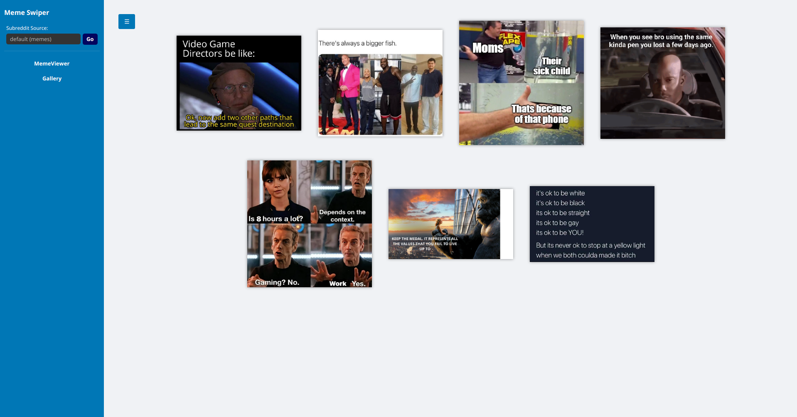
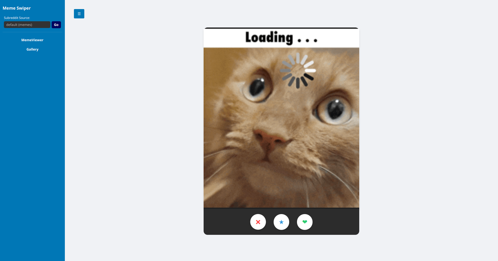

# 🚀 Meme Swiper - JavaFX Desktop App

Bienvenido a **Meme Swiper**, una aplicación de escritorio moderna construida con **JavaFX** y **Gradle** que permite explorar, guardar y gestionar tus memes favoritos de forma fluida y visual.

La aplicación continúa en desarrollo activo, permitiendo disfrutar ya de sus funcionalidades principales con una arquitectura robusta y modular.

---

## 📸 Capturas de Pantalla

|                                  Galería de Favoritos                                   |
|:---------------------------------------------------------------------------------------:|
|     |
|                                     Vista Principal                                     |
||

---

## 📋 Requisitos Previos

Este proyecto utiliza estándares modernos y estables. Asegúrate de tener:

* **Java JDK 21 (LTS)**: El proyecto ha sido realizado en esta versión para garantizar estabilidad y compatibilidad a largo plazo.
* **Conexión a Internet**: Necesaria para descargar dependencias de Gradle y consumir la API de memes en tiempo real.

---

## ☕ Nota sobre la Versión de Java (Java Toolchains)

Este proyecto utiliza **Gradle Java Toolchains**. Esto significa que:

1.  **Automático:** Si tienes Java 21 instalado, Gradle lo detectará y usará automáticamente.
2.  **Aprovisionamiento:** Si **no** tienes Java 21, Gradle intentará descargarlo en un entorno aislado (sandbox) para ejecutar la aplicación sin que tengas que instalar nada manualmente.
3.  **Compatibilidad:** Si tu sistema usa una versión más moderna (ej. Java 25) por defecto, puedes forzar el uso de una versión estable lanzando el comando así:
    `JAVA_HOME=/ruta/a/tu/java-21 ./gradlew run`

---

## 🛠️ Instrucciones de Instalación

Sigue estos pasos para poner en marcha el proyecto en tu máquina local:

### 1. Clonar el repositorio
Abre una terminal y ejecuta:
```bash
git clone [https://github.com/Pabl0125/MemeSwiper.git]
cd MemeSwiper
```
### 2. Ejecutar la aplicación

Utiliza el **Gradle Wrapper** incluido (recomendado para evitar conflictos de versiones de Gradle):

* **En Windows (PowerShell/CMD):**
```powershell
./gradlew run
```


* **En Linux o macOS:**
```bash
chmod +x gradlew
./gradlew run
```


---

## 🕹️ Funcionalidades Principales

* **Visor con Swipe:** Sistema de cartas interactivo para navegar por memes aleatorios ("Like" / "Dislike").
* **Galería de Favoritos:** Persistencia de datos local en `liked_memes.json` para guardar tu colección.
* **Vista de Detalle:** Inspecciona memes en la más alta resolución.
* **Descarga:** Guarda los memes originales directamente a tu disco duro.
* **Gestión de Memoria:** Carga asíncrona de imágenes y limpieza de recursos para una experiencia fluida.

---

## 🌍 Créditos de la API

Este proyecto utiliza la excelente API de memes desarrollada por **D3vd**. Gracias a este servicio, podemos obtener contenido actualizado de los subreddits más populares.

* **API utilizada:** [Meme_Api](https://github.com/D3vd/Meme_Api)
* **Autor:** [@D3vd](https://github.com/D3vd)

---

## 📂 Estructura del Proyecto

* `src/main/java`:
* **Controladores:** Lógica de la UI (`HelloController`, `GalleryController`, `DetailController`).
* **API & Modelos:** Clases de comunicación (`MemeRequester`) y objetos de datos (`MemeResponse`).


* `src/main/resources`:
* **Vista:** Archivos FXML para la arquitectura de la interfaz.
* **Estilos:** CSS para el tema oscuro personalizado.
* **Assets:** Imágenes de carga (GIFs).


* `build.gradle.kts`: Configuración del proyecto, dependencias y plugin `jlink` para crear ejecutables nativos.

---

## 🛠️ Tecnologías Utilizadas

* **Java 21 (LTS)** - Lenguaje base y estándar de estabilidad.
* **JavaFX 21** - Framework para la interfaz de usuario moderna.
* **Gradle 8.10+** - Gestor de construcción y dependencias (vía Wrapper).
* **Jackson** - Manejo profesional de JSON.
* **ControlsFX** - Componentes visuales adicionales.